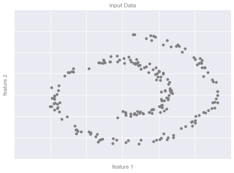
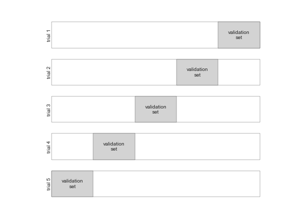
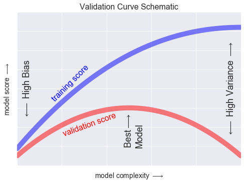
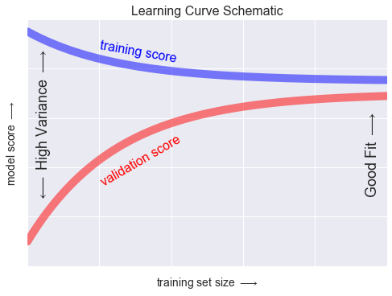
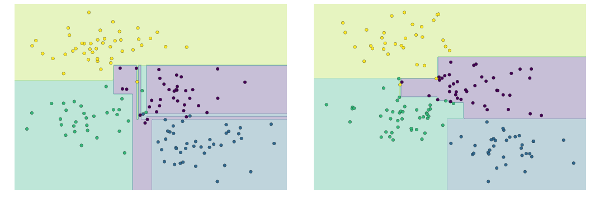
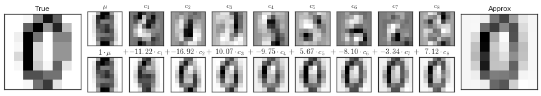
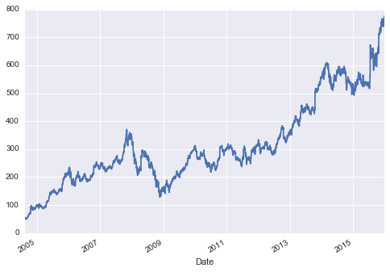
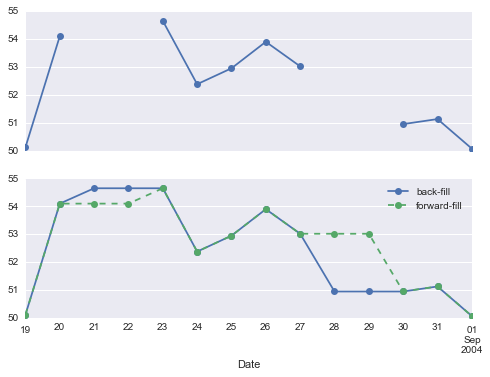
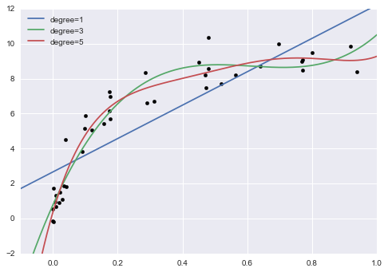

If there is a setup then install it.

ls */setup.py

# Load some repos as submodules.


```python
    from importnb import Interactive
```


```python
    with Interactive():
        from install import repos
        from compute_environment import write as write_deps, dependencies
```

# All the dependencies


```python
    from importnb import Notebook, Execute
    from importnb.capture import capture_output
    from importnb.execute import Interactive


    from IPython import display as d
    import pandas
    import timeout_decorator
    

    import os
    modules = {}

    from poser import *
    from collections import ChainMap
```


```python
kernel_name = 'bench'
```

    !source activate $kernel_name && pip install importnb timeout_decorator poser pyyaml


```python
env = ChainMap()
```


```python
with capture_output():
    for directory in λ.map(a.str.rsplit('/', 1).last().Path())(repos):
        if (directory / 'requirements.txt').exists():
            env = λ.Path.read_text().str.splitlines()[lambda x: {'dependencies': [
                {'pip': x}
            ]}][{directory: λ.identity()}][env.new_child](directory / 'requirements.txt')
        if (directory / 'environment.yml').exists():
            env = λ.Path.read_text().io.StringIO().yaml.safe_load()[{directory: λ.identity()}][env.new_child](directory / 'environment.yml')
```


```python
    dependencies = (
        λ / λ.valmap(λ.get('dependencies')).dict.values()
    ).concat().list()[lambda x: sum(x, [])](env.maps)

    dependencies = (
        λ
        .filter(λ**dict)
        .map(x['pip'])
        .concat().map(a.str.split('==').first()).unique().list()
        [[λ[{'pip': λ.identity()}]]]
    ).concatv(
        (λ//λ**str*a.unique().sorted().list())(dependencies)
    ).list()[{
        'name': kernel_name,
        'channels': (
            λ.map(dict.values)
            .concat().map(λ.methodcaller('get', 'channels', [])).concat().unique().sorted().list()
        )(env.maps),
        'dependencies': λ.identity(),
    }](dependencies)
    dependencies['dependencies'][-1]['pip'] = list(set(dependencies['dependencies'][-1]['pip']) - set(dependencies['dependencies'][:-1]))
```


```python
with open('environment.yml', 'w') as f:
    λ.yaml.safe_dump(default_flow_style=False)[f.write](dependencies)
```

    !conda create -yn $kernel_name python=3.6

    !conda env update -n $kernel_name 

# The setups


```python
with capture_output():
    for directory in λ.map(a.str.rsplit('/', 1).last().Path())(repos):
        if (directory / 'setup.py').exists():
            !source activate $kernel_name && cd $directory && python setup.py develop
```


```python
     display = dict(stdout=True, display=True, stderr=True,)
```


```python
    timeout = 10
```

    !conda install -yn $kernel_name astropy

    import os

    os.chdir('../..')


```python
import pydmd
```

    with Notebook(dir='PyDMD/tutorials/') as l:
        test = l.from_filename('tutorial-1-dmd.ipynb')

    with Notebook(dir='NeuNorm/notebooks') as l:
        l.from_filename('tutorial_using_array_input_and_several_roi.ipynb')


```python
    from pathlib import Path
```


```python
    current = Path('PyDMD/')
    with Interactive(**display, exceptions=BaseException, dir='PyDMD/tutorials') as loader:
        for i, file in enumerate(Path().rglob('*.ipynb')):
            if 'checkpoint' not in str(file):
                print(current, file)
                modules[current/file.name] = timeout_decorator.timeout(timeout)(loader.from_filename)(file.name)
                print('Excepts', modules[current/file.name]._exception)
```

    PyDMD tutorial-1-dmd.ipynb
    Excepts None
    PyDMD tutorial-2-adv-dmd.ipynb
    Excepts 'Timed Out'
    PyDMD tutorial-3-mrdmd.ipynb
    Excepts 'Timed Out'
    PyDMD tutorial-4-cdmd.ipynb
    Excepts 'Timed Out'
    PyDMD tutorial-5-fbdmd.ipynb
    Excepts None
    PyDMD tutorial-6-hodmd.ipynb
    Excepts None


```python
    current = Path('NeuNorm/')
    with Interactive(**display, exceptions=BaseException, dir='NeuNorm/notebooks') as loader:
        for i, file in enumerate(Path().rglob('*.ipynb')):
            if 'checkpoint' not in str(file):
                print(current, file)
                modules[current/file.name] = timeout_decorator.timeout(timeout)(loader.from_filename)(file.name)
```

    NeuNorm debugging_multi_roi_bug.ipynb
    NeuNorm ipts-16259.ipynb
    NeuNorm notebook_display_with_time_estimation.ipynb
    NeuNorm testing_new_auto_gamma_filtering.ipynb
    NeuNorm tutorial_normalization_with_fewer_ob_than_sample.ipynb
    NeuNorm tutorial_normalization_with_fewer_ob_than_sample_MAYBE_BUG.ipynb
    NeuNorm tutorial_using_array_input.ipynb
    NeuNorm tutorial_using_array_input_and_export_array.ipynb
    NeuNorm tutorial_using_array_input_and_several_roi.ipynb
    NeuNorm tutorial_using_folder_input.ipynb


```python
    current = Path('ThinkDSP/code/')
    with Interactive(**display, exceptions=BaseException, dir=current) as loader:
        for i, file in enumerate(Path().rglob('*.ipynb')):
            if 'checkpoint' not in str(file):
                print(current, file)
                modules[current/file.name] = timeout_decorator.timeout(timeout)(loader.from_filename)(file)
                print('Excepts', modules[current/file.name]._exception)
```

    ThinkDSP/code cacophony.ipynb
    ThinkDSP/code chap01.ipynb
    ThinkDSP/code chap01soln.ipynb
    ThinkDSP/code chap02.ipynb
    ThinkDSP/code chap02soln.ipynb
    ThinkDSP/code chap03.ipynb
    ThinkDSP/code chap03soln.ipynb
    ThinkDSP/code chap04.ipynb
    ThinkDSP/code chap04soln.ipynb
    ThinkDSP/code chap05soln.ipynb
    ThinkDSP/code chap06.ipynb
    ThinkDSP/code chap06soln.ipynb
    ThinkDSP/code chap06starter.ipynb
    ThinkDSP/code chap07.ipynb
    ThinkDSP/code chap07soln.ipynb
    ThinkDSP/code chap08.ipynb
    ThinkDSP/code chap09.ipynb
    ThinkDSP/code chap09soln.ipynb
    ThinkDSP/code chap10.ipynb
    ThinkDSP/code chap10preview.ipynb
    ThinkDSP/code chap10soln.ipynb
    ThinkDSP/code chap11.ipynb
    ThinkDSP/code chap11soln.ipynb
    ThinkDSP/code diff_int.ipynb
    ThinkDSP/code phase.ipynb
    ThinkDSP/code saxophone.ipynb
    ThinkDSP/code scipy2015_demo.ipynb
    ThinkDSP/code voss.ipynb


```python
    from importnb.capture import capture_output
```


```python
    current = Path('PythonDataScienceHandbook/notebooks/')
    
    with capture_output(stdout=False), Interactive(exceptions=BaseException, stdout=True, display=True, stderr=True, dir=current) as loader:
        for i, file in enumerate(Path().rglob('*.ipynb')):
            if 'checkpoint' not in str(file):
                with capture_output(stdout=False):
                    print(file)
                    modules[current/file.name] = timeout_decorator.timeout(timeout)(loader.from_filename)(file)
                    print('Excepts', modules[current/file.name]._exception)
```

    00.00-Preface.ipynb
    Excepts None
    01.00-IPython-Beyond-Normal-Python.ipynb
    Excepts None
    01.01-Help-And-Documentation.ipynb
    Excepts None
    01.02-Shell-Keyboard-Shortcuts.ipynb
    Excepts None
    01.03-Magic-Commands.ipynb
    Excepts None
    01.04-Input-Output-History.ipynb
    Excepts None
    01.05-IPython-And-Shell-Commands.ipynb
    Excepts None
    01.06-Errors-and-Debugging.ipynb
    Excepts division by zero
    01.07-Timing-and-Profiling.ipynb
    Excepts 'Timed Out'
    01.08-More-IPython-Resources.ipynb
    Excepts None
    02.00-Introduction-to-NumPy.ipynb
    Excepts None
    02.01-Understanding-Data-Types.ipynb
    Excepts None
    02.02-The-Basics-Of-NumPy-Arrays.ipynb
    Excepts None
    02.03-Computation-on-arrays-ufuncs.ipynb
    Excepts 'Timed Out'
    02.04-Computation-on-arrays-aggregates.ipynb
    Excepts 'Timed Out'
    02.05-Computation-on-arrays-broadcasting.ipynb
    Excepts operands could not be broadcast together with shapes (3,2) (3,) 
    02.06-Boolean-Arrays-and-Masks.ipynb
    Excepts The truth value of an array with more than one element is ambiguous. Use a.any() or a.all()
    02.07-Fancy-Indexing.ipynb
    Excepts 'Timed Out'
    02.08-Sorting.ipynb
    Excepts None
    02.09-Structured-Data-NumPy.ipynb
    Excepts 'Timed Out'
    03.00-Introduction-to-Pandas.ipynb
    Excepts None
    03.01-Introducing-Pandas-Objects.ipynb
    Excepts Index does not support mutable operations
    03.02-Data-Indexing-and-Selection.ipynb
    Excepts None
    03.03-Operations-in-Pandas.ipynb
    Excepts None
    03.04-Missing-Values.ipynb
    Excepts 'Timed Out'
    03.05-Hierarchical-Indexing.ipynb
    Excepts invalid syntax (<unknown>, line 1)
    03.06-Concat-And-Append.ipynb


    ---------------------------------------------------------------------------

    ValueError                                Traceback (most recent call last)

    ~/anaconda/envs/bench/lib/python3.6/site-packages/IPython/core/formatters.py in __call__(self, obj)
        700                 type_pprinters=self.type_printers,
        701                 deferred_pprinters=self.deferred_printers)
    --> 702             printer.pretty(obj)
        703             printer.flush()
        704             return stream.getvalue()


    ~/anaconda/envs/bench/lib/python3.6/site-packages/IPython/lib/pretty.py in pretty(self, obj)
        398                         if cls is not object \
        399                                 and callable(cls.__dict__.get('__repr__')):
    --> 400                             return _repr_pprint(obj, self, cycle)
        401 
        402             return _default_pprint(obj, self, cycle)


    ~/anaconda/envs/bench/lib/python3.6/site-packages/IPython/lib/pretty.py in _repr_pprint(obj, p, cycle)
        693     """A pprint that just redirects to the normal repr function."""
        694     # Find newlines and replace them with p.break_()
    --> 695     output = repr(obj)
        696     for idx,output_line in enumerate(output.splitlines()):
        697         if idx:


    ~/_bench/PythonDataScienceHandbook/notebooks/03.06-Concat-And-Append.ipynb in __repr__(self)
        154     "    def __repr__(self):\n",
        155     "        return '\\n\\n'.join(a + '\\n' + repr(eval(a))\n",
    --> 156     "                           for a in self.args)\n",
        157     "    "
        158    ]


    ~/_bench/PythonDataScienceHandbook/notebooks/03.06-Concat-And-Append.ipynb in <genexpr>(.0)
        154     "    def __repr__(self):\n",
        155     "        return '\\n\\n'.join(a + '\\n' + repr(eval(a))\n",
    --> 156     "                           for a in self.args)\n",
        157     "    "
        158    ]


    ~/_bench/PythonDataScienceHandbook/notebooks/03.06-Concat-And-Append.ipynb in <module>()


    ~/anaconda/envs/bench/lib/python3.6/site-packages/pandas/core/reshape/concat.py in concat(objs, axis, join, join_axes, ignore_index, keys, levels, names, verify_integrity, sort, copy)
        223                        keys=keys, levels=levels, names=names,
        224                        verify_integrity=verify_integrity,
    --> 225                        copy=copy, sort=sort)
        226     return op.get_result()
        227 


    ~/anaconda/envs/bench/lib/python3.6/site-packages/pandas/core/reshape/concat.py in __init__(self, objs, axis, join, join_axes, keys, levels, names, ignore_index, verify_integrity, copy, sort)
        322             axis = DataFrame()._get_axis_number(axis)
        323         else:
    --> 324             axis = sample._get_axis_number(axis)
        325 
        326         # Need to flip BlockManager axis in the DataFrame special case


    ~/anaconda/envs/bench/lib/python3.6/site-packages/pandas/core/generic.py in _get_axis_number(self, axis)
        372                 pass
        373         raise ValueError('No axis named {0} for object type {1}'
    --> 374                          .format(axis, type(self)))
        375 
        376     def _get_axis_name(self, axis):


    ValueError: No axis named col for object type <class 'pandas.core.frame.DataFrame'>


    ---------------------------------------------------------------------------

    ValueError                                Traceback (most recent call last)

    ~/anaconda/envs/bench/lib/python3.6/site-packages/IPython/core/formatters.py in __call__(self, obj)
        343             method = get_real_method(obj, self.print_method)
        344             if method is not None:
    --> 345                 return method()
        346             return None
        347         else:


    ~/_bench/PythonDataScienceHandbook/notebooks/03.06-Concat-And-Append.ipynb in _repr_html_(self)
        150     "    def _repr_html_(self):\n",
        151     "        return '\\n'.join(self.template.format(a, eval(a)._repr_html_())\n",
    --> 152     "                         for a in self.args)\n",
        153     "    \n",
        154     "    def __repr__(self):\n",


    ~/_bench/PythonDataScienceHandbook/notebooks/03.06-Concat-And-Append.ipynb in <genexpr>(.0)
        150     "    def _repr_html_(self):\n",
        151     "        return '\\n'.join(self.template.format(a, eval(a)._repr_html_())\n",
    --> 152     "                         for a in self.args)\n",
        153     "    \n",
        154     "    def __repr__(self):\n",


    ~/_bench/PythonDataScienceHandbook/notebooks/03.06-Concat-And-Append.ipynb in <module>()


    ~/anaconda/envs/bench/lib/python3.6/site-packages/pandas/core/reshape/concat.py in concat(objs, axis, join, join_axes, ignore_index, keys, levels, names, verify_integrity, sort, copy)
        223                        keys=keys, levels=levels, names=names,
        224                        verify_integrity=verify_integrity,
    --> 225                        copy=copy, sort=sort)
        226     return op.get_result()
        227 


    ~/anaconda/envs/bench/lib/python3.6/site-packages/pandas/core/reshape/concat.py in __init__(self, objs, axis, join, join_axes, keys, levels, names, ignore_index, verify_integrity, copy, sort)
        322             axis = DataFrame()._get_axis_number(axis)
        323         else:
    --> 324             axis = sample._get_axis_number(axis)
        325 
        326         # Need to flip BlockManager axis in the DataFrame special case


    ~/anaconda/envs/bench/lib/python3.6/site-packages/pandas/core/generic.py in _get_axis_number(self, axis)
        372                 pass
        373         raise ValueError('No axis named {0} for object type {1}'
    --> 374                          .format(axis, type(self)))
        375 
        376     def _get_axis_name(self, axis):


    ValueError: No axis named col for object type <class 'pandas.core.frame.DataFrame'>


    Excepts None
    03.07-Merge-and-Join.ipynb
    Excepts None
    03.08-Aggregation-and-Grouping.ipynb
    Excepts None
    03.09-Pivot-Tables.ipynb
    Excepts None
    03.10-Working-With-Strings.ipynb
    Excepts 'NoneType' object has no attribute 'capitalize'
    03.11-Working-with-Time-Series.ipynb
    Excepts cannot import name 'is_list_like'
    03.12-Performance-Eval-and-Query.ipynb
    Excepts 'Timed Out'
    03.13-Further-Resources.ipynb
    Excepts None
    04.00-Introduction-To-Matplotlib.ipynb
    Excepts None
    04.01-Simple-Line-Plots.ipynb
    Excepts None
    04.02-Simple-Scatter-Plots.ipynb
    Excepts None
    04.03-Errorbars.ipynb
    Excepts None
    04.04-Density-and-Contour-Plots.ipynb
    Excepts None
    04.05-Histograms-and-Binnings.ipynb
    Excepts None
    04.06-Customizing-Legends.ipynb
    Excepts None
    04.07-Customizing-Colorbars.ipynb
    Excepts None
    04.08-Multiple-Subplots.ipynb
    Excepts None
    04.09-Text-and-Annotation.ipynb
    Excepts None
    04.10-Customizing-Ticks.ipynb
    Excepts None
    04.11-Settings-and-Stylesheets.ipynb
    Excepts Unknown property axisbg
    04.12-Three-Dimensional-Plotting.ipynb
    Excepts None
    04.13-Geographic-Data-With-Basemap.ipynb
    Excepts No module named 'mpl_toolkits.basemap'
    04.14-Visualization-With-Seaborn.ipynb
    Excepts File b'marathon-data.csv' does not exist
    04.15-Further-Resources.ipynb
    Excepts None
    05.00-Machine-Learning.ipynb
    Excepts None
    05.01-What-Is-Machine-Learning.ipynb
    Excepts None
    05.02-Introducing-Scikit-Learn.ipynb
    Excepts Colormap spectral is not recognized. Possible values are: Accent, Accent_r, Blues, Blues_r, BrBG, BrBG_r, BuGn, BuGn_r, BuPu, BuPu_r, CMRmap, CMRmap_r, Dark2, Dark2_r, GnBu, GnBu_r, Greens, Greens_r, Greys, Greys_r, OrRd, OrRd_r, Oranges, Oranges_r, PRGn, PRGn_r, Paired, Paired_r, Pastel1, Pastel1_r, Pastel2, Pastel2_r, PiYG, PiYG_r, PuBu, PuBuGn, PuBuGn_r, PuBu_r, PuOr, PuOr_r, PuRd, PuRd_r, Purples, Purples_r, RdBu, RdBu_r, RdGy, RdGy_r, RdPu, RdPu_r, RdYlBu, RdYlBu_r, RdYlGn, RdYlGn_r, Reds, Reds_r, Set1, Set1_r, Set2, Set2_r, Set3, Set3_r, Spectral, Spectral_r, Wistia, Wistia_r, YlGn, YlGnBu, YlGnBu_r, YlGn_r, YlOrBr, YlOrBr_r, YlOrRd, YlOrRd_r, afmhot, afmhot_r, autumn, autumn_r, binary, binary_r, bone, bone_r, brg, brg_r, bwr, bwr_r, cividis, cividis_r, cool, cool_r, coolwarm, coolwarm_r, copper, copper_r, cubehelix, cubehelix_r, flag, flag_r, gist_earth, gist_earth_r, gist_gray, gist_gray_r, gist_heat, gist_heat_r, gist_ncar, gist_ncar_r, gist_rainbow, gist_rainbow_r, gist_stern, gist_stern_r, gist_yarg, gist_yarg_r, gnuplot, gnuplot2, gnuplot2_r, gnuplot_r, gray, gray_r, hot, hot_r, hsv, hsv_r, icefire, icefire_r, inferno, inferno_r, jet, jet_r, magma, magma_r, mako, mako_r, nipy_spectral, nipy_spectral_r, ocean, ocean_r, pink, pink_r, plasma, plasma_r, prism, prism_r, rainbow, rainbow_r, rocket, rocket_r, seismic, seismic_r, spring, spring_r, summer, summer_r, tab10, tab10_r, tab20, tab20_r, tab20b, tab20b_r, tab20c, tab20c_r, terrain, terrain_r, viridis, viridis_r, vlag, vlag_r, winter, winter_r
    05.03-Hyperparameters-and-Model-Validation.ipynb
    Excepts None
    05.04-Feature-Engineering.ipynb
    Excepts None
    05.05-Naive-Bayes.ipynb
    Excepts None
    05.06-Linear-Regression.ipynb
    Excepts File b'FremontBridge.csv' does not exist
    05.07-Support-Vector-Machines.ipynb


    ---------------------------------------------------------------------------

    TimeoutError                              Traceback (most recent call last)

    ~/_bench/PythonDataScienceHandbook/notebooks/03.12-Performance-Eval-and-Query.ipynb in <module>()


    ~/anaconda/envs/bench/lib/python3.6/site-packages/sklearn/grid_search.py in fit(self, X, y)
        836 
        837         """
    --> 838         return self._fit(X, y, ParameterGrid(self.param_grid))
        839 
        840 


    ~/anaconda/envs/bench/lib/python3.6/site-packages/sklearn/grid_search.py in _fit(self, X, y, parameter_iterable)
        572                                     self.fit_params, return_parameters=True,
        573                                     error_score=self.error_score)
    --> 574                 for parameters in parameter_iterable
        575                 for train, test in cv)
        576 


    ~/anaconda/envs/bench/lib/python3.6/site-packages/sklearn/externals/joblib/parallel.py in __call__(self, iterable)
        777             # was dispatched. In particular this covers the edge
        778             # case of Parallel used with an exhausted iterator.
    --> 779             while self.dispatch_one_batch(iterator):
        780                 self._iterating = True
        781             else:


    ~/anaconda/envs/bench/lib/python3.6/site-packages/sklearn/externals/joblib/parallel.py in dispatch_one_batch(self, iterator)
        623                 return False
        624             else:
    --> 625                 self._dispatch(tasks)
        626                 return True
        627 


    ~/anaconda/envs/bench/lib/python3.6/site-packages/sklearn/externals/joblib/parallel.py in _dispatch(self, batch)
        586         dispatch_timestamp = time.time()
        587         cb = BatchCompletionCallBack(dispatch_timestamp, len(batch), self)
    --> 588         job = self._backend.apply_async(batch, callback=cb)
        589         self._jobs.append(job)
        590 


    ~/anaconda/envs/bench/lib/python3.6/site-packages/sklearn/externals/joblib/_parallel_backends.py in apply_async(self, func, callback)
        109     def apply_async(self, func, callback=None):
        110         """Schedule a func to be run"""
    --> 111         result = ImmediateResult(func)
        112         if callback:
        113             callback(result)


    ~/anaconda/envs/bench/lib/python3.6/site-packages/sklearn/externals/joblib/_parallel_backends.py in __init__(self, batch)
        330         # Don't delay the application, to avoid keeping the input
        331         # arguments in memory
    --> 332         self.results = batch()
        333 
        334     def get(self):


    ~/anaconda/envs/bench/lib/python3.6/site-packages/sklearn/externals/joblib/parallel.py in __call__(self)
        129 
        130     def __call__(self):
    --> 131         return [func(*args, **kwargs) for func, args, kwargs in self.items]
        132 
        133     def __len__(self):


    ~/anaconda/envs/bench/lib/python3.6/site-packages/sklearn/externals/joblib/parallel.py in <listcomp>(.0)
        129 
        130     def __call__(self):
    --> 131         return [func(*args, **kwargs) for func, args, kwargs in self.items]
        132 
        133     def __len__(self):


    ~/anaconda/envs/bench/lib/python3.6/site-packages/sklearn/cross_validation.py in _fit_and_score(estimator, X, y, scorer, train, test, verbose, parameters, fit_params, return_train_score, return_parameters, error_score)
       1673             estimator.fit(X_train, **fit_params)
       1674         else:
    -> 1675             estimator.fit(X_train, y_train, **fit_params)
       1676 
       1677     except Exception as e:


    ~/anaconda/envs/bench/lib/python3.6/site-packages/sklearn/pipeline.py in fit(self, X, y, **fit_params)
        248         Xt, fit_params = self._fit(X, y, **fit_params)
        249         if self._final_estimator is not None:
    --> 250             self._final_estimator.fit(Xt, y, **fit_params)
        251         return self
        252 


    ~/anaconda/envs/bench/lib/python3.6/site-packages/sklearn/svm/base.py in fit(self, X, y, sample_weight)
        185 
        186         seed = rnd.randint(np.iinfo('i').max)
    --> 187         fit(X, y, sample_weight, solver_type, kernel, random_seed=seed)
        188         # see comment on the other call to np.iinfo in this file
        189 


    ~/anaconda/envs/bench/lib/python3.6/site-packages/sklearn/svm/base.py in _dense_fit(self, X, y, sample_weight, solver_type, kernel, random_seed)
        252                 cache_size=self.cache_size, coef0=self.coef0,
        253                 gamma=self._gamma, epsilon=self.epsilon,
    --> 254                 max_iter=self.max_iter, random_seed=random_seed)
        255 
        256         self._warn_from_fit_status()


    ~/anaconda/envs/bench/lib/python3.6/site-packages/timeout_decorator/timeout_decorator.py in handler(signum, frame)
         70         if use_signals:
         71             def handler(signum, frame):
    ---> 72                 _raise_exception(timeout_exception, exception_message)
         73 
         74             @wraps(function)


    ~/anaconda/envs/bench/lib/python3.6/site-packages/timeout_decorator/timeout_decorator.py in _raise_exception(exception, exception_message)
         43     """
         44     if exception_message is None:
    ---> 45         raise exception()
         46     else:
         47         raise exception(value=exception_message)


    TimeoutError: 'Timed Out'


    Excepts None
    05.09-Principal-Component-Analysis.ipynb
    Excepts Colormap spectral is not recognized. Possible values are: Accent, Accent_r, Blues, Blues_r, BrBG, BrBG_r, BuGn, BuGn_r, BuPu, BuPu_r, CMRmap, CMRmap_r, Dark2, Dark2_r, GnBu, GnBu_r, Greens, Greens_r, Greys, Greys_r, OrRd, OrRd_r, Oranges, Oranges_r, PRGn, PRGn_r, Paired, Paired_r, Pastel1, Pastel1_r, Pastel2, Pastel2_r, PiYG, PiYG_r, PuBu, PuBuGn, PuBuGn_r, PuBu_r, PuOr, PuOr_r, PuRd, PuRd_r, Purples, Purples_r, RdBu, RdBu_r, RdGy, RdGy_r, RdPu, RdPu_r, RdYlBu, RdYlBu_r, RdYlGn, RdYlGn_r, Reds, Reds_r, Set1, Set1_r, Set2, Set2_r, Set3, Set3_r, Spectral, Spectral_r, Wistia, Wistia_r, YlGn, YlGnBu, YlGnBu_r, YlGn_r, YlOrBr, YlOrBr_r, YlOrRd, YlOrRd_r, afmhot, afmhot_r, autumn, autumn_r, binary, binary_r, bone, bone_r, brg, brg_r, bwr, bwr_r, cividis, cividis_r, cool, cool_r, coolwarm, coolwarm_r, copper, copper_r, cubehelix, cubehelix_r, flag, flag_r, gist_earth, gist_earth_r, gist_gray, gist_gray_r, gist_heat, gist_heat_r, gist_ncar, gist_ncar_r, gist_rainbow, gist_rainbow_r, gist_stern, gist_stern_r, gist_yarg, gist_yarg_r, gnuplot, gnuplot2, gnuplot2_r, gnuplot_r, gray, gray_r, hot, hot_r, hsv, hsv_r, icefire, icefire_r, inferno, inferno_r, jet, jet_r, magma, magma_r, mako, mako_r, nipy_spectral, nipy_spectral_r, ocean, ocean_r, pink, pink_r, plasma, plasma_r, prism, prism_r, rainbow, rainbow_r, rocket, rocket_r, seismic, seismic_r, spring, spring_r, summer, summer_r, tab10, tab10_r, tab20, tab20_r, tab20b, tab20b_r, tab20c, tab20c_r, terrain, terrain_r, viridis, viridis_r, vlag, vlag_r, winter, winter_r
    05.10-Manifold-Learning.ipynb
    Excepts 'Timed Out'
    05.11-K-Means.ipynb
    Excepts 'Timed Out'
    05.12-Gaussian-Mixtures.ipynb
    Excepts 'Timed Out'
    05.13-Kernel-Density-Estimation.ipynb
    Excepts No module named 'mpl_toolkits.basemap'
    05.14-Image-Features.ipynb
    Excepts 'Timed Out'
    05.15-Learning-More.ipynb
    Excepts None
    06.00-Figure-Code.ipynb
    Excepts %%file is a cell magic, but the cell body is empty.
    Index.ipynb
    Excepts None


```python
    current = Path('pyunfold')
    with Interactive(exceptions=BaseException, stdout=True, display=True, stderr=True) as loader:
        for i, file in enumerate(Path(current).rglob('*.ipynb')):
            if 'checkpoint' not in str(file):
                with capture_output(stdout=False):
                    print(file)
                    modules[current/file.name] = timeout_decorator.timeout(timeout)(loader.from_filename)(file)
```

    pyunfold/docs/source/notebooks/multivariate.ipynb
    pyunfold/docs/source/notebooks/regularization.ipynb
    pyunfold/docs/source/notebooks/tutorial.ipynb
    pyunfold/docs/source/notebooks/user_prior.ipynb


```python
    df = pandas.DataFrame(dict(zip(modules, map(vars, modules.values())))).T

    df = pandas.concat({
        file: pandas.DataFrame(df['_notebook'].loc[file]['cells'])
        for file in df['_notebook'].dropna().index
    }).reset_index(-1, drop=True).join(df)

    languages = df['_notebook'].groupby([df.index, df.cell_type]).count().unstack()

    g = df['_exception'].groupby(df.index).unique().apply(lambda x: not x[0]).pipe(
        lambda s: s.groupby(s.index.map(lambda x: x.parent)).agg(('sum', 'count'))).astype(int)
```


```python
    (g['sum']/g['count']).to_frame('percentages')
```


<div>
<style scoped>
    .dataframe tbody tr th:only-of-type {
        vertical-align: middle;
    }

    .dataframe tbody tr th {
        vertical-align: top;
    }

    .dataframe thead th {
        text-align: right;
    }
</style>
<table border="1" class="dataframe">
  <thead>
    <tr style="text-align: right;">
      <th></th>
      <th>percentages</th>
    </tr>
  </thead>
  <tbody>
    <tr>
      <th>NeuNorm</th>
      <td>0.500000</td>
    </tr>
    <tr>
      <th>PyDMD</th>
      <td>0.500000</td>
    </tr>
    <tr>
      <th>PythonDataScienceHandbook/notebooks</th>
      <td>0.602941</td>
    </tr>
    <tr>
      <th>ThinkDSP/code</th>
      <td>0.666667</td>
    </tr>
    <tr>
      <th>pyunfold</th>
      <td>1.000000</td>
    </tr>
  </tbody>
</table>
</div>


```python
    df.sample(2)
```


<div>
<style scoped>
    .dataframe tbody tr th:only-of-type {
        vertical-align: middle;
    }

    .dataframe tbody tr th {
        vertical-align: top;
    }

    .dataframe thead th {
        text-align: right;
    }
</style>
<table border="1" class="dataframe">
  <thead>
    <tr style="text-align: right;">
      <th></th>
      <th>cell_type</th>
      <th>execution_count</th>
      <th>metadata</th>
      <th>outputs</th>
      <th>source</th>
      <th>A</th>
      <th>Audio</th>
      <th>B</th>
      <th>BDay</th>
      <th>BaggingClassifier</th>
      <th>...</th>
      <th>ys2</th>
      <th>ytest</th>
      <th>ytrain</th>
      <th>ytrue</th>
      <th>yy</th>
      <th>z</th>
      <th>zdata</th>
      <th>zero_angle</th>
      <th>zline</th>
      <th>zz</th>
    </tr>
  </thead>
  <tbody>
    <tr>
      <th>PythonDataScienceHandbook/notebooks/03.04-Missing-Values.ipynb</th>
      <td>markdown</td>
      <td>NaN</td>
      <td>{'lineno': 127}</td>
      <td>NaN</td>
      <td>This ``dtype=object`` means that the best comm...</td>
      <td>NaN</td>
      <td>NaN</td>
      <td>NaN</td>
      <td>NaN</td>
      <td>NaN</td>
      <td>...</td>
      <td>NaN</td>
      <td>NaN</td>
      <td>NaN</td>
      <td>NaN</td>
      <td>NaN</td>
      <td>NaN</td>
      <td>NaN</td>
      <td>NaN</td>
      <td>NaN</td>
      <td>NaN</td>
    </tr>
    <tr>
      <th>ThinkDSP/code/chap11.ipynb</th>
      <td>code</td>
      <td>47.0</td>
      <td>{'collapsed': False, 'lineno': 1452}</td>
      <td>[{'data': {'text/html': ['\n', '              ...</td>
      <td>filtered.make_audio()</td>
      <td>NaN</td>
      <td>NaN</td>
      <td>NaN</td>
      <td>NaN</td>
      <td>NaN</td>
      <td>...</td>
      <td>NaN</td>
      <td>NaN</td>
      <td>NaN</td>
      <td>NaN</td>
      <td>NaN</td>
      <td>NaN</td>
      <td>NaN</td>
      <td>NaN</td>
      <td>NaN</td>
      <td>NaN</td>
    </tr>
  </tbody>
</table>
<p>2 rows × 817 columns</p>
</div>


```python
    len(df.columns)
```


    817


# The displays


```python
button = λ.ipywidgets.Button(description="Show 💩")()

def sample(i=10):
    λ.do(λ.IPython.display.clear_output()).IPython.display.display(button)()
    #λ.IPython.display.display(button)()

    s = (
        df['_notebook']
        .sample(5)
        .apply(
            λ.get('cells')
            .filter(
                λ.itemgetter('cell_type')
                .eq('code')
            )
            .pluck('outputs').concat().filter(λ.contains('data')).pluck('data').list()
        )
    ).pipe(lambda x: x[x.astype(bool)])
    
    (
        λ.take(5).map(
            the.do(
                λ.first()['# [{0}]({0})'.format].IPython.display.Markdown().IPython.display.display()
            ).second().map(λ.IPython.display.publish_display_data()).list()
        ).list().len()
    )(s.items())

    λ.IPython.display.display(button)()
    return s
```


```python
button.on_click(sample)
```


```python
%%html
<style>
    #notebook .output {
        display: flex !important;
        flex-direction: row;
        flex-wrap: wrap;
        max-width: 90vw;
        align-items: center;
    }
    #notebook .output_markdown {
        /*min-width: 88vw;*/
            word-wrap: break-word;
    }
    #notebook .output_area {
        flex: 1;
        min-width: 30rem;
        transition: all 0.2s;
        z-index: 999;
    }
    #notebook div.output_subarea {
        padding: 0 !important;
    }
    #notebook .output_area:hover {
        flex: 10;
        transition: all 0.2s;
        z-index: 999;
    }
</style>
```


<style>
    #notebook .output {
        display: flex !important;
        flex-direction: row;
        flex-wrap: wrap;
        max-width: 90vw;
        align-items: center;
    }
    #notebook .output_markdown {
        /*min-width: 88vw;*/
            word-wrap: break-word;
    }
    #notebook .output_area {
        flex: 1;
        min-width: 30rem;
        transition: all 0.2s;
        z-index: 999;
    }
    #notebook div.output_subarea {
        padding: 0 !important;
    }
    #notebook .output_area:hover {
        flex: 10;
        transition: all 0.2s;
        z-index: 999;
    }
</style>


```python
button
```


    Button(description='Show 💩', style=ButtonStyle())


    None


# [PythonDataScienceHandbook/notebooks/06.00-Figure-Code.ipynb](PythonDataScienceHandbook/notebooks/06.00-Figure-Code.ipynb)




















# [PythonDataScienceHandbook/notebooks/03.11-Working-with-Time-Series.ipynb](PythonDataScienceHandbook/notebooks/03.11-Working-with-Time-Series.ipynb)








# [PythonDataScienceHandbook/notebooks/05.03-Hyperparameters-and-Model-Validation.ipynb](PythonDataScienceHandbook/notebooks/05.03-Hyperparameters-and-Model-Validation.ipynb)





# [PythonDataScienceHandbook/notebooks/05.04-Feature-Engineering.ipynb](PythonDataScienceHandbook/notebooks/05.04-Feature-Engineering.ipynb)


    Button(description='Show 💩', style=ButtonStyle())

